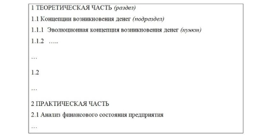
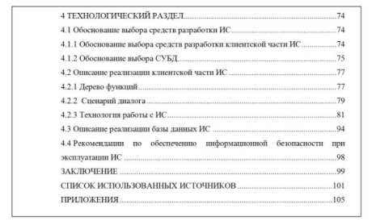
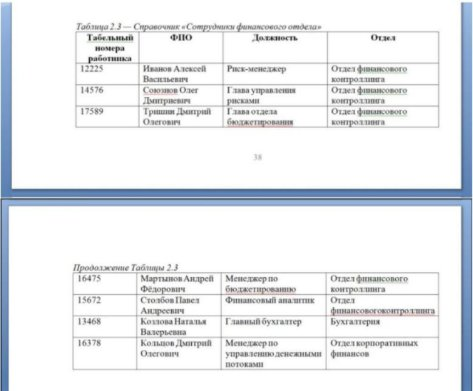
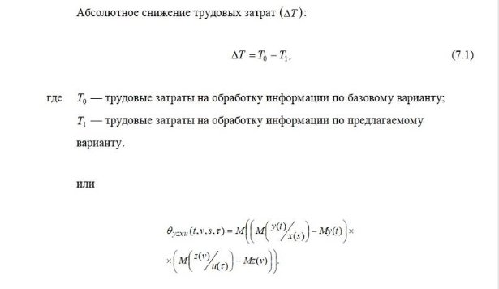
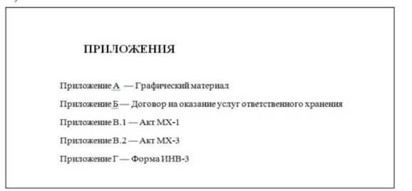


|`   `|
| :-: |
|МИНОБРНАУКИ РОССИИ|
|
Федеральное государственное бюджетное образовательное учреждение

высшего образования

**«МИРЭА - Российский технологический университет»**

**РТУ МИРЭА**

|
|
**ИНСТИТУТ ПЕРСПЕКТИВНЫХ ТЕХНОЛОГИЙ И ИНДУСТРИАЛЬНОГО ПРОГРАММИРОВАНИЯ**

**КАФЕДРА ИНДУСТРИАЛЬНОГО ПРОГРАММИРОВАНИЯ** 

УТВЕРЖДЕНО

протоколом заседания кафедры

индустриального программирования №\_\_\_

от \_\_\_\_\_\_\_\_\_\_\_\_\_\_\_\_\_\_\_\_\_\_
|

**Методические рекомендации по подготовке и защите**

**ВЫПУСКНОЙ КВАЛИФИКАЦИОННОЙ РАБОТЫ** 

**БАКАЛАВРА**

для студентов, обучающихся по направлению

**09.03.02 Информационные системы и технологии**

Квалификация

**Бакалавр**

Москва, 2023
**\

ОГЛАВЛЕНИЕ

[ВВЕДЕНИЕ	4](#_toc223294655 "#_Toc223294655")

[I. ВКР КАК ФОРМА ГОСУДАРСТВЕННОЙ ИТОГОВОЙ АТТЕСТАЦИИ	5](#_toc223294656 "#_Toc223294656")

[1. Общие положения	5](#_toc223294657 "#_Toc223294657")

[2. Цели и задачи ВКР	6](#_toc223294658 "#_Toc223294658")

[3. Основные этапы выполнения ВКР	7](#_toc223294659 "#_Toc223294659")

[3.1. Выбор темы исследования и утверждение руководителя	8](#_toc223294660 "#_Toc223294660")

[3.2. Составление задания на ВКР бакалавра и описание этапов ее выполнения	8](#_toc223294661 "#_Toc223294661")

[3.3. Подбор литературы и аналитический обзор	9](#_toc223294662 "#_Toc223294662")

[3.4. Проверка на объем заимствования	10](#_toc223294663 "#_Toc223294663")

[3.5. Предварительные защиты	10](#_toc223294664 "#_Toc223294664")

[3.6. Процесс рецензирования	11](#_toc223294665 "#_Toc223294665")

[4. Защита ВКР	11](#_toc223294666 "#_Toc223294666")

[5. Критерии оценки ВКР	12](#_toc223294667 "#_Toc223294667")

[II. ТРЕБОВАНИЯ К ОФОРМЛЕНИЮ ВКР	13](#_toc223294668 "#_Toc223294668")

[1. Подготовка письменных материалов. Структура ВКР.	13](#_toc223294669 "#_Toc223294669")

[2. Макет страницы	16](#_toc223294670 "#_Toc223294670")

[3. Правила, распространяющиеся на весь текст	16](#_toc223294671 "#_Toc223294671")

[4. Основной текст	18](#_toc223294672 "#_Toc223294672")

[5. Заголовки	18](#_toc223294673 "#_Toc223294673")

[6. Содержание	20](#_toc223294674 "#_Toc223294674")

[7. Таблицы	21](#_toc223294675 "#_Toc223294675")

[8. Рисунки	23](#_toc223294676 "#_Toc223294676")

[9. Формулы	24](#_toc223294677 "#_Toc223294677")

[10. Маркированные списки	25](#_toc223294678 "#_Toc223294678")

[11. Нумерованные списки	26](#_toc223294679 "#_Toc223294679")

[12. Текст (листинг программ)	26](#_toc223294680 "#_Toc223294680")

[13. Список использованных источников	28](#_toc223294681 "#_Toc223294681")

[14. Приложения	28](#_toc223294682 "#_Toc223294682")

[15. Повторная проверка	29](#_toc223294683 "#_Toc223294683")

[16. Требования к оформлению презентационных материалов	29](#_toc223294684 "#_Toc223294684")

Настоящие рекомендации были разработаны на основе следующих стандартов: 

1. ГОСТ 7.32-2017 «Система стандартов по информации, библиотечному и издательскому делу. Отчет о научно-исследовательской работе. Структура и правила оформления». 
1. ГОСТ 7.79-2000 «Система стандартов по информации, библиотечному и издательскому делу. Правила транслитерации кирилловского письма латинским алфавитом». 
1. ГОСТ 7.11-2004 «Система стандартов по информации, библиотечному и издательскому делу. Библиографическая запись. Сокращение слов и словосочетаний на иностранных европейских языках». 
1. ГОСТ 7.12-9 «Система стандартов по информации, библиотечному и издательскому делу. Библиографическая запись. Сокращение слов на русском языке. Общие требования и правила». 
1. ГОСТ 2.001-2013 «Единая система конструкторской документации. Общие положения». 
1. ГОСТ Р 2.105-2019 «Единая система конструкторской документации.  Общие требования к текстовым документам». 
1. ГОСТ Р 7.0.12-2011 «Система стандартов по информации, библиотечному и издательскому делу. Библиографическая запись. Сокращение слов и словосочетаний на русском языке. Общие требования и правила». 
1. СМКО МИРЭА 7.5.1/03.П.67-19 «Положение о выпускной квалификационной работе студентов, обучающихся по образовательным программам подготовки бакалавров»
1. СМКО МИРЭА 8.5.1/02.П.05-21 «Положение о подготовке и защите выпускных квалификационных работ в виде стартап-проектов»
1. СМКО МИРЭА 7.5.1/03.П.57-18 «Порядок проведения проверки на объем заимствования и размещения в сети интернет выпускных квалификационных работ и научных докладов об основных результатах подготовленных диссертаций»

   Методические рекомендации разработаны с целью обеспечения единства требований к содержанию, качеству и оформлению выпускных квалификационных работ обучающихся, осваивающих профессиональные образовательные программы в рамках направления подготовки 09.03.02 Информационные системы и технологии.** 
# **ВВЕДЕНИЕ** 
` `Методические рекомендации по подготовке и защите выпускной квалификационной работы студентов, обучающихся по образовательным программам подготовки бакалавров (далее – ВКР бакалавра / бакалаврская работа) определяют требования к содержанию и оформлению ВКР бакалавра, критерии оценки и правила подготовки к ее защите на основе специфики направления подготовки и направленности (профиля) образовательной программы бакалавриата.

Как заключительный этап обучения студента в вузе выполнение ВКР имеет целью углубление, закрепление и систематизацию его теоретических знаний, овладение им навыками применения полученных знаний при самостоятельном решении инженерных технических и научно-исследовательских задач, развитие его творческих способностей. 

ВКР бакалавра является квалификационной работой теоретического или прикладного характера, связанной с решением задач производственно-технологического типа. Она посвящена решению актуальной научной или научно-практической задачи или совокупности задач, объединенных общей целью, и должна быть выполнена лично автором для получения по результатам публичной защиты квалификации (степени) бакалавра. 

Результаты ВКР бакалавра должны соответствовать требованиям научной новизны, практической полезности и значимости, а также целям и задачам программы бакалавриата и федерального государственного образовательного стандарта высшего образования (далее – ФГОС ВО) по направлениям подготовки бакалавриата. 

ВКР бакалавра выполняется непосредственно обучающимся (совместно несколькими обучающимися) и может представлять: законченную научную или научно-практическую 	работу, представляющую интерес для развития определенной области знаний; исследование, являющееся основой для последующего развития и углубленного решения важной научной или научно-технической проблемы и характеризующее его автора как специалиста, соответствующего требованиям ФГОС ВО по направлению подготовки 09.03.02 Информационные системы и технологии. 

ВКР бакалавра должна быть написана грамотным литературным и научным языком с применением лексики, принятой в научном сообществе, узаконенных терминов, определений, исключающих неоднозначность восприятия описываемых проблем, решаемых задач и полученных результатов.

# **I. ВКР КАК ФОРМА ГОСУДАРСТВЕННОЙ ИТОГОВОЙ АТТЕСТАЦИИ**
**1. Общие положения** 

В РТУ МИРЭА государственная итоговая аттестация проводится в форме защиты выпускной квалификационной работы, что означает, что ВКР является итоговой аттестационной работой обучающегося, представляемой для присуждения ему соответствующей квалификации.   

ВКР является заключительным этапом обучения студентов по ОП ВО.

ВКР и ее защита является обязательной формой государственной итоговой аттестации лиц, завершающих освоение образовательной программы бакалавриата. 

ВКР представляет собой работу, демонстрирующую уровень подготовленности выпускника к самостоятельной профессиональной деятельности.   

Порядок и форма выполнения ВКР определяется ОП ВО для соответствующего профиля направления подготовки, реализуемого в университете. В РТУ МИРЭА ВКР обучающегося может представлять: 

- законченную научную или научно-практическую работу, представляющую интерес для развития определенной области знаний;
- ` `исследование, являющееся основой для последующего развития и углубленного решения важной научной или научно-технической проблемы и характеризующее его автора как специалиста, соответствующего требованиям ФГОС ВО по направлению подготовки к соискателю квалификации (степени) бакалавра;
- стартап как диплом.

Источниками тематики ВКР бакалавров могут служить: прямые заказы научных и производственных предприятий и организаций, соответствующие направлению подготовки выпускника; научно-исследовательская тематика кафедры; научные интересы руководителя программы бакалавриата и научного руководителя ВКР; результаты практик обучающегося в научных, производственных, организационных и/или коммерческих структурах подразделений предприятий и организаций, соответствующих направлению подготовки.    

ВКР является квалификационной работой, отвечающей требованиям программ обучения и свидетельствующей о том, что ее автор научился самостоятельно: 

- осуществлять критический анализ проблемных ситуаций на основе системного подхода, вырабатывать стратегию действий;
- управлять проектом на всех этапах его жизненного цикла;
- организовывать и руководить работой команды, вырабатывая командную стратегию для достижения поставленной цели;
- разрабатывать оригинальные алгоритмы и программные средства, в том числе с использованием современных интеллектуальных технологий, для решения профессиональных задач;
- анализировать профессиональную информацию, выделять в ней главное, структурировать, оформлять и представлять в виде аналитических обзоров с обоснованными выводами и рекомендациями;
- применять на практике новые научные принципы и методы исследований;
- разрабатывать и модернизировать программное и аппаратное обеспечение информационных и автоматизированных систем;
- использовать методы и средства системной инженерии в области получения, передачи, хранения, переработки и представления информации посредством информационных технологий;
- разрабатывать и применять математические модели процессов и объектов при решении задач анализа и синтеза распределенных информационных систем и систем поддержки принятия решений;
- осуществлять эффективное управление разработкой программных средств и проектов;
- руководить разработкой программного обеспечения для решения индустриальных задач;
- принимать управленческие решения по модификации архитектуры индустриальных программных продуктов и рефакторингу программного кода.

**2. Цели и задачи ВКР**

Выполнение ВКР имеет следующие цели: 

- систематизация, расширение, закрепление и обобщение теоретических знаний и практических умений по направлению и использование их при решении профессиональных задач; 
- решение задач, имеющих практическое значение; 
- решение научной задачи в определенной области знаний; 
- развитие методов исследования в области знаний, соответствующих направлению подготовки в бакалавриате; 
- проведение разработок, обеспечивающих решение важных научных и/или прикладных задач в области знаний, соответствующих направлению подготовки в бакалавриате. 
- развитие навыков самостоятельной научной работы и овладение методикой построения экспериментальных исследований; 
- приобретение обучающимися опыта оформления, представления и публичной защиты результатов своей научно-исследовательской и профессиональной деятельности; 
- оценку степени и уровня подготовленности обучающихся к профессиональной деятельности, сформированности у них компетенций в соответствии с требованиями ФГОС ВО. 

Задачами выполнения ВКР и ее защиты являются: 

- демонстрация сформированных компетенций в соответствии с требованиями ФГОС ВО; 
- применение полученных знаний при решении прикладных задач по направлению подготовки; 
- выявление 	подготовленности обучающихся к практической деятельности в условиях инновационной экономики; 
- овладение современными методами научного исследования;
- систематизация, закрепление и расширение полученных в процессе обучения теоретических и практических знаний по направлению подготовки;  
- развитие умения критически оценивать и обобщать теоретические положения, вырабатывать собственную точку зрения по рассматриваемым проблемам;  
- приобретение необходимых для практической деятельности навыков самостоятельной аналитической и исследовательской работы; 
- навыков защиты научных идей, предложений и рекомендаций.

**3. Основные этапы выполнения ВКР** 

Процесс подготовки ВКР условно делится на три этапа: 

**Подготовительный:**  

- выбор темы;
- утверждение темы и научного руководителя.

**Основной этап:** 

- составление задания на ВКР бакалавра и описание этапов ее выполнения;
- изучение и обобщение состояния проблемы в современной                    отечественной и зарубежной практике; 
- выполнение работы согласно плану. 

` `**Завершающий этап:** 

- проверка на объем заимствования;
- предварительные защиты;
- процесс рецензирования;
- доработка согласно выявленным недостаткам; 
- размещение на портале РТУ МИРЭА;
- публичная защита.
### **3.1. Выбор темы исследования и утверждение руководителя**
Порядок выбора и закрепления тем ВКР регламентируется п. 3\
СМКО МИРЭА 7.5.1/03.П.67-19 «Положение о выпускной квалификационной работе студентов, обучающихся по образовательным программам подготовки бакалавров». 

По письменному заявлению обучающегося (нескольких обучающихся, выполняющих ВКР бакалавра совместно) кафедра может в установленном ею порядке предоставить обучающемуся (обучающимся) возможность подготовки и защиты ВКР бакалавра по теме, предложенной обучающимся (обучающимися), в случае обоснования целесообразности ее разработки для практического применения в соответствующей области профессиональной деятельности или на конкретном объекте профессиональной деятельности.

При формулировании инициативной темы ВКР необходимо учитывать, что в названии темы не допускается использование сокращений и аббревиатур. Тема ВКР должна содержать признак действия, например разработка, моделирование, реализация, исследование, и т. п.  

Руководитель образовательной программы имеет право отклонить инициативную тему ВКР или порекомендовать переформулировать ее.  

При выборе темы ВКР обучающийся должен руководствоваться следующим:  

- актуальность темы исследования;
- новизна;
- теоретическая и практическая значимость;
- перспективность;
- соответствие направлению подготовки и профилю обучения.
### **3.2. Составление задания на ВКР бакалавра и описание этапов ее выполнения**
Задание на ВКР бакалавра и описание этапов ее выполнения составляется на основе п. 3.8-3.9 СМКО МИРЭА 7.5.1/03.П.67-19 «Положение о выпускной квалификационной работе студентов, обучающихся по образовательным программам подготовки бакалавров» и Приложения №3 к нему. 
### **3.3. Подбор литературы и аналитический обзор**
От подобранной литературы во многом зависят результаты работы. 

Отбираемые публикации должны оцениваться с точки зрения:  

- новизны;
- точности; 
- объективности;
- достоверности.

  При отборе литературных источников следует обращать внимание на следующие показатели: 

- Impact Factor – показатель значимости научного журнала;
- индекс Хирша – индекс научного цитирования автора публикации;
- SJR и/или SNIP – рейтинг журнала;
- РИНЦ – российский индекс научного цитирования.

  Рекомендуемое число литературных источников – не менее 30, включая отечественные и зарубежных публикации. При этом, 50% и более источников должны быть не старше 5 лет, не менее 50% источников должны быть зарубежными.

  При подборе литературных источников обучающиеся могут использовать информационные издания: реферативные журналы, бюллетени, аналитические обзоры, реферативные обзоры и др. Также рекомендуется использовать другие информационные ресурсы сети Интернет. 

  Следует относиться с осторожностью к публикациям в нерецензируемых научных изданиях.  

  Анализ литературных источников излагается в формате реферата в виде аналитического обзора исследуемой предметной области.   

  Аналитический обзор – это систематизированные сведения и научные обобщения о состоянии, тенденциях и прогнозах развития выбранной области исследования. «Изучение и обобщение передового опыта является одним из основных источников развития науки, поскольку позволяет выявлять актуальные научные проблемы, создает основу для изучения закономерностей развития процессов в целом ряде областей научного знания». 

  Аналитический обзор должен содержать выводы, формулировку задач, список цитируемой литературы, представляющей интерес для дальнейшего исследования. Следует помнить, что реферативное описание характеризуется краткостью и дается без искажений и субъективных оценок.  

Аналитический обзор включается в первую главу ВКР. 
### **3.4. Проверка на объем заимствования**
При защите ВКР бакалавра особое внимание уделяется недопущению нарушения обучающимися правил профессиональной этики. К таким нарушениям относятся в первую очередь плагиат, фальсификация данных и ложное цитирование. 

Под плагиатом понимается наличие прямых заимствований без соответствующих ссылок из всех печатных и электронных источников, защищенных ранее выпускных квалификационных работ, кандидатских и докторских диссертаций. 

Под фальсификацией данных понимается подделка или изменение исходных данных с целью доказательства правильности вывода (подтверждения гипотезы и т.д.), а также умышленное использование ложных данных в качестве основы для анализа. 

Под ложным цитированием понимается наличие ссылок на источник, когда данный источник такой информации не содержит.

Обнаружение указанных нарушений профессиональной этики является основанием для снижения оценки за ВКР бакалавра, вплоть до применения к обучающемуся мер дисциплинарного воздействия в соответствии с СМКО МИРЭА 7.5.1/03.П.57-18 «Порядок проведения проверки на объем заимствования и размещения в сети интернет выпускных квалификационных работ и научных докладов об основных результатах подготовленных диссертаций».

Проверка ВКР на объем заимствования осуществляется в системе «Руконтекст».  

Файл ВКР предоставляется для проверки в системе «Руконтектс» в формате «pdf» или «docx». Название файла с ВКР состоит из двух слов и начинается с фамилии автора работы: «Surname\_thesis».  

Оригинальность текста должна составлять 55% и более.  
### **3.5. Предварительные защиты**
Для повышения качества подготовки ВКР кафедра осуществляет плановые слушания хода их выполнения, по результатам которых принимаются решения о необходимых мерах по корректировке работы студентов. График предварительных защит устанавливается кафедрой в рабочем порядке.

**4. Защита ВКР**

К защите ВКР допускаются следующие обучающиеся: 

- не имеющие академической задолженности;
- выполнившие задание на ВКР;
- прошедшие процедуру проверки ВКР в системе «Руконтекст».

Электронная версия ВКР должна быть загружена в систему\
СДО РТУ МИРЭА не позднее чем за 5 календарных дней до защиты.

Защита ВКР бакалавра происходит на открытом заседании ГЭК. Решения, принятые ГЭК, оформляются протоколами в соответствии с Порядком проведения государственной итоговой аттестации по образовательным программам высшего образования – программам бакалавриата, программам специалитета и программам магистратуры (СМКО МИРЭА 7.5.1/03.П.30). 

Защита ВКР бакалавра включает в себя устный доклад обучающегося, ответы на вопросы членов ГЭК, комментарии членов ГЭК и заключительное слово обучающегося, содержащее ответ на замечания и пожелания, высказанные членами комиссии во время защиты. 

Доклад обучающегося должен сопровождаться презентационными материалами, предназначенными для всеобщего просмотра (презентация в любом специализированном офисном программном обеспечении). 

В докладе обучающегося обязательно должны быть отражены следующие вопросы: название ВКР бакалавра; актуальность темы ВКР бакалавра; цели и задачи ВКР бакалавра; полученные основные результаты; теоретическая и практическая значимость полученных обучающимся результатов; значение проведенного исследования и полученных результатов для развития собственной карьеры. 

Итоговая оценка выставляется ГЭК по итогам защиты ВКР бакалавра с учетом оценки, выставленной руководителем работы и рецензентом (при наличии), а также результатов проверки ВКР бакалавра на предмет соответствия требованиям СМКО МИРЭА 7.5.1/03.П.67-19 «Положение о выпускной квалификационной работе студентов, обучающихся по образовательным программам подготовки бакалавров» и настоящих Методических рекомендаций по подготовке и защите ВКР бакалавра.

**5. Критерии оценки ВКР** 

Положения, выносимые на защиту, выводы и рекомендации, представленные в ВКР, должны основываться на новейших научно-технических достижениях в исследуемой предметной области.  

Все рекомендации и предложения должны быть обоснованы с позиций эффективности, целесообразности и перспектив использования в практической деятельности.  

ВКР оценивают на соответствие следующим требованиям: 

- соответствие уровню основной профессиональной ОП и квалификации, присваиваемой выпускнику после завершения аттестационных испытаний;  
- соответствие направлению подготовки и профилю образовательной программы; 
- актуальность – важность и значимость разработки данной темы для научной области или предприятия; 
- умение самостоятельно систематизировать материалы, демонстрировать компетенции, приобретенные в процессе обучения и исследования по теме ВКР;  
- завершенность, четкость структуры, логичная последовательность изложения материала, обоснованность сделанных выводов и предложений; 
- публикации по теме исследования, представление результатов на конференциях или внедрение результатов в производство; 
- глубина проработки ВКР;
- полнота использования литературных источников по теме ВКР;
- корректное использование публикаций других авторов.

Новизна и практическая значимость ВКР являются основными критериями качества выполненной работы.  

Обсуждение работ происходит после защиты на закрытом заседании ГЭК.  

Результаты каждого государственного аттестационного испытания определяются оценками «отлично», «хорошо», «удовлетворительно», «неудовлетворительно». Оценки «отлично», «хорошо», «удовлетворительно» означают успешное прохождение государственного аттестационного испытания.** 

По положительным результатам государственной итоговой аттестации, оформленным протоколами, ГЭК принимает решение о присвоении выпускникам квалификации «бакалавр» по направлению подготовки и выдаче дипломов о высшем образовании государственного образца.

Результаты защиты объявляет председатель ГЭК в тот же день после утверждения протокола заседания государственной комиссии.   

# **II. ТРЕБОВАНИЯ К ОФОРМЛЕНИЮ ВКР**
**1. Подготовка письменных материалов. Структура ВКР.**

Текст ВКР готовится в одном файле в редакторе документов, поддерживающем форматы .doc (.docx).

Выполнение требований к ВКР бакалавра и реализацию ее назначения обеспечивает структура диссертации. 

Обязательными структурными элементами являются: 

- титульный лист (по форме, утвержденной в СМКО МИРЭА 7.5.1/03.П.67-19); 
- задание на ВКР бакалавра (по форме, утвержденной в СМКО МИРЭА 7.5.1/03.П.67-19); 
- аннотация на русском языке объемом не более 150 слов (содержит сведения об объеме ВКР, числе страниц печатного текста, количестве рисунков, таблиц, приложений, количестве использованных источников, перечень ключевых слов (от 5 до 15 слов или словосочетаний из текста ВКР));
- оглавление; 
- список используемых сокращений и обозначений (при необходимости); 
- введение (содержит обоснование выбора темы ВКР бакалавра и ее актуальности; формулировку цели и задач исследования; понятия объекта и предмета исследования); 
- литературный обзор (раскрывает/определяет положение бакалаврской работы в общей структуре публикаций по данной теме); 
- основную часть ВКР бакалавра, которая включает разделы работы с обобщением в конце каждого из них, и может содержать: теоретическую и экспериментальную (при наличии) части, включая объекты и (или) предметы исследования, методики исследования, методы получения, математические модели, алгоритмы расчетов; результаты работы и их обсуждение, в том числе обсуждение полученных ранее результатов, анализ результатов, указание предполагаемого вклада автора в решаемую проблему; 
- заключение, содержащее формулировку выводов по выполненной работе; 
- список использованных литературных источников (список литературы); приложения (при наличии), которые содержат материалы, имеющие дополнительное справочное или документально подтверждающее значение выполненной бакалаврской работы. 

  Приложения не должны составлять более 1/3 от общего объема ВКР бакалавра. 

  Общий объем ВКР бакалавра должен составлять от 40 до 60 страниц машинописного текста (не считая приложений).

  Основная часть ВКР бакалавра включает:

  – литературный обзор и анализ предметной области;

  – теоретическое и проектное обоснование решения;

  – результаты реализации и их обсуждение.

  При работе над ВКР бакалавра основное внимание должно быть уделено *литературному обзору и анализу предметной области*. В ходе исследования должны быть получены результаты, которые подробно отражены в бакалаврской работе, в докладе на защите и в презентации. 

  *Литературный обзор и анализ предметной области* содержит аналитическое обоснование выбранного направления разработки и выполняется в соответствии со следующими этапами:

1) Определение направления разработки.
1) Ознакомление с научной, учебной и нормативной литературой по теме.
1) Анализ публикаций и существующих технических решений.
1) Выявление недостаточно проработанных аспектов рассматриваемой проблемы.
1) Формирование предварительного понимания задачи разработки.
1) Обоснование актуальности выбранной темы.
1) Определение объекта и предмета разработки.
1) Формулирование цели выпускной квалификационной работы.
1) Формулирование конкретных задач разработки.
1) Определение требований к разрабатываемому решению.
1) Систематизация полученной информации и формирование постановки задачи.

*Теоретическое и проектное обоснование решения* направлено на разработку концептуальной и архитектурной модели создаваемого решения и выполняется в соответствии со следующими этапами:

1) Уточнение постановки задачи разработки.
1) Выбор архитектурного подхода к построению системы.
1) Определение структуры и состава компонентов решения.
1) Проектирование взаимосвязей между компонентами системы.
1) Разработка модели данных и структуры входной и выходной информации.
1) Разработка общей схемы алгоритма решения поставленной задачи.
1) Детализация алгоритмов обработки данных.
1) Выбор методов и инструментальных средств реализации.
1) Проектирование пользовательского взаимодействия с системой.
1) Обоснование принятых проектных решений.
1) Формирование проектной модели разрабатываемого решения.

*Результаты реализации и их обсуждение* содержат описание практической реализации разработанного решения и выполняются в соответствии со следующими этапами:

1) Подготовка среды разработки и необходимых инструментов.
1) Реализация архитектуры и программных модулей системы.
1) Реализация алгоритмов обработки данных.
1) Создание структуры хранения данных (при необходимости).
1) Разработка пользовательского интерфейса.
1) Отладка программного продукта.
1) Разработка тестовых сценариев и проведение тестирования.
1) Анализ соответствия полученного решения сформированным требованиям.
1) Обсуждение полученных результатов.
1) Оценка практической значимости разработанного решения.
1) Формулирование выводов по результатам реализации.

**2. Макет страницы**

Макет страницы настраивается в соответствии с параметрами, приведенными в Таблице 2.1.

*Таблица 2.1 – Основные настройки содержательной части раздела «Макет»*

|Наименование|Описание||
| :-: | :-: | :- |
|Поля|Верхнее|20 мм|
||Нижнее|20 мм|
||Левое|30 мм|
||Правое|15 мм|
|Ориентация|Книжная||
|Размер|A4||
|Колонки|1||

***Примечание*.** Обратите внимание, что форматирование отдельных страниц, отличающееся от заданного, возможно в исключительных случаях, речь о которых пойдет далее.

**3. Правила, распространяющиеся на весь текст**

3\.1 Пробел ставится после любого знака пунктуации, но не перед ним.  Исключение составляют открывающие скобки и открывающие кавычки, где пробел ставится перед ним, но не после.

***Пример:** Данный текст составлен исключительно для примера, чтобы можно было оценить множество «возможных» вариантов пунктуациио.*

3\.2 По всей работе имеется сквозная нумерация страниц арабскими числами в нижнем колонтитуле по центру, начиная с содержания. Страница содержания имеет номер, исходя из наличия всех прочих страниц до нее.

***Пример:** У письменной работы есть титульный лист, задание и аннотация (три страницы), то содержание будет располагаться на четвертой странице, следовательно, нумерация начинается с числа «4».*

3\.3 Не допускается перенос слов и сноски в конце страниц.

3\.4 Не допускаются сокращения в тексте, исключения составляют общепринятые сокращения и сокращения, для которых в тексте была приведена полная расшифровка.

***Пример:** Данный текст был составлен в Институте перспективных технологий и индустриального программирования (далее – ИПТИП) в МИРЭА – Российском технологическом университете (далее – РТУ МИРЭА).* 

3\.5 Кавычки в русском тексте (включая список использованных источников) имеют форму «…», а в английском — "…".

3\.6 Различаются и правильно используются следующие знаки:

3\.6.1 Знак дефиса «-» не разделяется пробелами и используется:

для соединения сложных слов, содержащих дефисы;

для диапазонов и интервалов. (100-150 см).

***Пример:** физико-математический, во-первых, кто-либо, 100-150 см.*

3\.6.2 Знак минуса «–» используется как знак вычитания.

3\.6.3 Знак тире «—» разделяется пробелами и используется в соответствии с правилами пунктуации.

***Пример:** Экономика – это хозяйственная деятельность.*

3\.7 При приведении цифрового материала используются только арабские цифры, за исключением общепринятой нумерации кварталов, полугодий, которые обозначаются римскими цифрами. Римские цифры и даты, обозначаемые арабскими цифрами, не должны сопровождаться падежными окончаниями. Количественные числительные в тексте пишутся также без падежных окончаний. Если в тексте необходимо привести ряд величин одной и той же размерности, то единица измерения указывается только после последнего числа. Для величин, имеющих два предела, единица измерения пишется только один раз при второй цифре.

3\.8 Математические знаки, такие как «+», «–», «=», «>», «<» и так далее используются только в формулах. В тексте их следует писать словами: «плюс», «минус», «равно», «больше», «меньше».

3\.9 Все иллюстрации, таблицы, листинги программ (тексты программ) располагаются в тексте непосредственно после абзаца, в котором они упоминаются впервые или на следующей странице.

3\.10 Иллюстрации, формулы (уравнения), таблицы, листинги, список использованных источников, нумеруется арабскими цифрами последовательно в пределах раздела. Номер раздела и порядковый номер разделяются точкой.

***Пример:** Рисунок 2.7.*

3\.11 Ссылки в тексте на иллюстрации, таблицы, листинги, приложения пишутся в круглых скобках или включаются в предложение. При ссылке следует писать слова «Рисунок», «Таблица», «Листинг», «Приложение» с большой буквы и с указанием их порядкового номера.

***Примеры:** ...(Таблица 5.4)., …представлено в Приложении А.*

3\.12 Содержание параграфов нельзя заканчивать таблицей, рисунком или формулой. После формулы, таблицы или рисунка должен присутствовать хотя бы один абзац текста.

3\.13 Фамилии, названия учреждений, организаций, фирм, название изделий и другие имена собственные в работе приводятся на языке оригинала. Допускается транслитерировать имена собственные и приводить названия организаций в переводе на русский язык с добавлением при первом упоминании оригинального названия.

**4. Основной текст**

Для основного текста используется стиль «Основной текст», определяемый настройками из Таблицы 4.1.

*Таблица 4.1 – Параметры стиля «Основной текст»*

|Наименование|Описание||
| - | - | :- |
|Шрифт|Шрифт|Times New Roman|
||Начертание|Обычный|
||Размер|14 пт|
||Цвет текста|Черный|
||Подчеркивание|Нет|
||Видоизменение|Нет|
|Абзац|Выравнивание|По ширине|
||Отступ слева|0|
||Отступ справа|0|
||Первая строка|Отступ на 1,25 см|
||Интервал перед|0|
||Интервал после|0|
||Междустрочный|1,5|

**5. Заголовки**

5\.1 Текст работы (проекта) разбивается на разделы, подразделы, пункты.

5\.2 Порядковая нумерация разделов, подразделов и пунктов осуществляется арабскими цифрами, начиная с 1 в пределах всей работы (проекта), за исключением приложений. После номера раздела, подраздела и пункта ставится пробел и без знаков препинания пишется заголовок. Номер подраздела состоит из номера раздела и порядкового номера подраздела, разделенных точкой. Пример обозначения разделов, подразделов и пунктов представлен на Рисунке 5.1.

**Рисунок 5.1 — Пример обозначения разделов, подразделов и пунктов**

5\.3 Разделы «Оглавление», «Введение», «Заключение», «Список использованных источников» не нумеруются.

5\.4 Разделы, подразделы, пункты имеют заголовки, четко и кратко отражающие содержание разделов, подразделов и пунктов.

5\.5 Введены следующие общие обозначения заголовков:

— заголовок раздела — Заголовок первого уровня;

— заголовок подраздела — Заголовок второго уровня;

— заголовок пунктов — Заголовок третьего и последующего уровней.

5\.6 Названия заголовков разделов, подразделов и пунктов соответствуют их наименованию, указанному в содержании и в задании на работу.

5\.7 Все названия заголовков печатаются с прописной буквы.

5\.8 В конце названия заголовков знак препинания не ставится. Если название заголовка состоит из двух предложений, их разделяют точкой.

5\.9 Названия основных разделов (оглавление, введение, заключение, список используемых источников, приложения), работы, отформатированное стилем «Заголовок первого уровня» с выравниванием по центру, печатаются прописными буквами с выравниванием по центру.

5\.10 Заголовки в работе делятся на несколько уровней в соответствии с уровнями внутри документа, где 1 уровень – заголовки разделов, 2 уровень – заголовки подразделов. Для каждого из уровней следует применить следующие правила форматирования из Таблицы 5.1.

*Таблица 5.1 – Стили «Заголовок\_1», «Заголовок\_2» и «Заголовок\_3...»*

|Позиция|1 уровень|2 уровень|3 и след. уровни||||||
| - | - | - | - | :- | :- | :- | :- | :- |
|Шрифт|Шрифт|Шрифт|Times New Roman||||||
|||Начертание|Полужирный||||||
|||Размер|18 пт|16 пт|14 пт||||
|||Цвет текста|Черный||||||
|||Подчеркивание|Нет||||||
|||Видоизменение|Все прописные|
Нет

|||||
||Интервал|Масштаб|100%||||||
|||Интервал|Обычный||||||
|||Смещение|Нет||||||
||Анимация|Вид|Нет||||||
|Абзац|Отступы и интервалы|Выравнивание|По ширине||||||
|||Отступ слева|0 см||||||
|||Отступ справа|0 см||||||
|||Первая строка|Отступ на 1,25 см||||||
|||Интервал перед|0 пт|24 пт|24 пт||||
|||Интервал после|12 пт||||||
|||Междустрочный|1,5||||||
||Положение на странице|Разбивка на страницы|Не отрывать от следующего||||||
||||С новой страницы|
Не разрывать абзац

|||||
|||||Запрет висящих строк|||||

**6. Оглавление**

6\.1 В первой строке листа печатается слово «Оглавление», отформатированное стилем «Заголовок первого уровня» с выравниванием по центру.

6\.2 Далее контекстное меню приложения следует вставить автоматически собираемое содержание, в котором следует использовать нумерацию по правому краю с использованием заполнителя точками «.....».

6\.3 Текст содержания должен быть отформатирован стилем «Основной текст» с последующим удалением отступа.

6\.4 Заголовки разделов «Введение», «Заключение», «Список использованных источников», «Приложения», «Теоретический раздел», «Практический раздел», «Технологический раздел» в содержании печатаются прописными буквами (Рисунок 6.1).

**Рисунок 6.1 – Пример внешнего вида содержания письменной работы**

6\.5 В случае, если текст содержания в какой-либо строке наезжает на область нахождения номеров страниц или отсутствует заполнитель перед номером страницы, то часть такой строки необходимо вручную перенести на следующую строчку.

**7. Таблицы**

7\.1 Каждая таблица в тексте должна иметь название, которое начинается в той же строке, что и ее номер через тире с большой буквы перед таблицей. Точка в конце не ставится.

Название таблицы следует отформатировать в соответствие с Таблицей 7.1.

*Таблица 7.1 – Стиль «Надпись. Таблица»*

|Позиция|Написание|||
| - | - | :- | :- |
|Шрифт|Шрифт|Шрифт|Times New Roman|
|||Начертание|Курсив|
|||Размер|12 пт|
|||Цвет текста|Черный|
|||||
|||Подчеркивание|Нет|
|||Видоизменение|Нет|
||Интервал|Масштаб|100%|
|||Интервал|Обычный|
|||Смещение|Нет|
||Анимация|Вид|Нет|
|Абзац|Отступы и интервалы|Выравнивание|По ширине|
|||Отступ слева|0 см|
|||Отступ справа|0 см|

*Продолжение Таблицы 7.1*

|||Первая строка|Нет|
| - | - | - | - |
|||Интервал перед|6 пт|
|||Интервал после|0 пт|
|||Междустрочный|Одинарный|
||Положение на странице|Разбивка на страницы|Не отрывать от следующего|
||||С новой страницы|

7\.2 Для содержимого таблицы необходимо установить автоподбор таблицы по содержимому.

7\.3 Для содержимого таблицы следует применить стили форматирования из Таблицы 7.2.

*Таблица 7.2 – Стиль «Таблица. Содержимое»*

|Позиция|Написание|||
| :-: | :-: | :- | :- |
|Шрифт|Шрифт|Шрифт|Times New Roman|
|||Начертание|Обычный, полужирный, курсив|
|||Размер|12 пт|
|||Цвет текста|Черный|
|||Подчеркивание|Нет|
|||Видоизменение|Нет|
||Интервал|Масштаб|100%|
|||Интервал|Обычный|
|||Смещение|Нет|
||Анимация|Вид|Нет|
|Абзац|Отступы и интервалы|Выравнивание|По ширине, по центру|
|||Отступ слева|0 см|
|||Отступ справа|0 см|
|||Первая строка|0 см|
|||Интервал перед|0 пт|
|||Интервал после|0 пт|
|||Междустрочный|Одинарный|

7\.4 Заголовки столбцов центрируются по ширине столбца, а заголовки строк выравниваются по левому краю. Заголовки граф и строк таблицы пишутся с прописной буквы в единственном числе, а подзаголовки граф — со строчной буквы, если они составляют одно предложение с заголовком, или с прописной буквы, если они имеют самостоятельное значение. В конце заголовков и подзаголовков таблиц знаки препинания не ставят. Диагональное деление ячеек таблицы не допускается.

7\.5 Строка, следующая за таблицей, печатается с интервалом перед 6 пт.

7\.6 Графу «№ п/п» в таблицу не включают. При необходимости нумерации показателей или других данных порядковые номера указывают в левом столбце таблицы перед их наименованием.

7\.7 При необходимости переноса части таблицы на другую страницу название помещают только над первой частью таблицы. Над другими частями пишется «Продолжение Таблицы 6.1», отформатированное стилем «Надпись. Таблица». Пример переноса представлен на Рисунке 7.1.

**Рисунок 7.1 – Пример переноса таблицы на новую страницу**

**8. Рисунки**

8\.1 Иллюстрации (графики, схемы, фотографии и т.п.) располагаются так, чтобы их было удобно рассматривать без поворота текста или путем переворачивания по часовой стрелке на 90º. В таком случае ориентация в параметрах страницы изменяется с книжной на альбомную.

8\.2 Название иллюстрации пишется после номера через тире и помещается после иллюстрации. Сокращение слова «Рисунок» не допускается. В конце названия иллюстрации точка не ставится.

***Пример:** Рисунок 1.4 — Детали прибора.* 

Параметры оформления подписи к иллюстрациям представлены в Таблице 8.1.

*Таблица 8.1 – Стиль «Подпись. Рисунок»*

|Позиция|Написание|||
| - | - | :- | :- |
|Шрифт|Шрифт|Шрифт|Times New Roman|
|||Начертание|Полужирный|
|||Размер|12 пт|
|||Цвет текста|Черный|
|||Подчеркивание|Нет|
|||Видоизменение|Нет|
||Интервал|Масштаб|100%|
|||Интервал|Обычный|
|||Смещение|Нет|
||Анимация|Вид|Нет|
|Абзац|Отступы и интервалы|Выравнивание|По центру|
|||Отступ слева|0 см|
|||Отступ справа|0 см|
|||Первая строка|Нет|
|||Интервал перед|0 пт|
|||Интервал после|6 пт|
|||Междустрочный|Одинарный|
||Положение на странице|Разбивка на страницы|Запрет висящих строк|

**9. Формулы**

9\.1 Формулы, уравнения и переменные набираются с использованием редактора формул Microsoft Equation или Math Type.

9\.2 Перед и после каждой формулы (уравнения) оставляется одна пустая строка.

9\.3 Текст формулы (уравнения) располагающейся на отдельной строчке, выравнивается по центру. Формат шрифтов и математический стиль устанавливаются по умолчанию.

9\.4 Если формула (уравнение) является концом предложения, ставится точка, если после формулы предложение продолжается — запятая.

9\.5 Если формула (уравнение) не умещается в одну строку, оно переносится после знака равенства (=) или после знаков плюс (+), минус (-), умножения (×) или деления (:). При этом знак в начале следующей строки повторяется.

9\.6 Формулы (уравнения) нумеруются последовательно в пределах раздела арабскими цифрами в круглых скобках, выровненных по правому краю. Нумеруются только те формулы, на которые имеются ссылки в тексте.

9\.7 Ссылки в тексте на номер формулы даются в круглых скобках.

***Пример:** …в формуле (7.1).*

9\.8 Пояснения значений символов и числовых коэффициентов следует приводить непосредственно под формулой в той же последовательности, в какой они даны в формуле. Первую строчку пояснения начинают без абзацного отступа со слова «где» без двоеточия после него. Значение каждого символа и числового коэффициента следует давать с новой строки, располагая символы один под другим.

Пример использования формул в тексте представлен на Рисунке 9.1.

**Рисунок 9.1 – Пример внедрения формул в текст**

**10. Маркированные списки**

10\.1 Маркированный список форматируется стилем «Основной текст работы». В работе применяется единый знак маркера – тире. Отступ маркера – 1,25 см. Табуляция текста - 2,25 см. Отступ слева - 0 см.

10\.2 Текст в маркированном списке начинается с маленькой (строчной) буквы, а заканчивается — точкой с запятой (последний пункт в списке заканчивается точкой).

***Пример:***

*первый элемент списка, который слишком длинный для одной строки, чтобы показать, что элемент слева имеет отступ только в первой строке;*

*второй элемент списка;*

*последний элемент списка.*

**11. Нумерованные списки**

11\.1 Нумерованный список форматируется стилем «Основной текст работы». Отступ маркера – 1,25 см. Табуляция текста - 2,25 см. Отступ слева - 0 см.

11\.2 Текст в нумерованном списке должен начинаться с прописной буквы и заканчиваться точкой.

***Пример:***

1. *Первый элемент в списке, который слишком длинный для одной строки, чтобы показать, что элемент слева имеет отступ только в первой строке.*
1. *Второй элемент в списке.*
1. *Последний элемент в списке.*

**12. Текст (листинг программ)** 

12\.1 В работе в зависимости от дисциплины и темы, по которой она пишется, могут содержаться отдельные фрагменты программ (листинг), в том числе разработанных студентом.

12\.2 Название листинга пишется в одну строку с номером, через тире, с большой буквы, перед листингом. Точка в конце не ставится.

***Пример:** Листинг 1.7 — Процедура открытия программы.*

12\.3 При ссылке на отдельные строки программы они нумеруются в порядке возрастания с шагом 10. После ссылки на листинг в фигурных скобках приводятся номера строк. 

***Примеры:** Листинг 3.2 {30, 50, 140}, Листинг 3.2 {20-80}.*

12\.4 Листинг оформляется в рамку.

12\.5 Параметры оформления листинга представлены в Таблицах 12.1-12.2.

*Таблица 12.1 – Стиль для надписей для листинга «Надпись. Листинг»*

|Позиция|Написание|||
| - | - | :- | :- |
|Шрифт|Шрифт|Шрифт|Times New Roman|
|||Начертание|Курсив|
|||Размер|12 пт|
|||Цвет текста|Черный|
|||Подчеркивание|Нет|
|||Видоизменение|Нет|
||Интервал|Масштаб|100%|
|||Интервал|Обычный|
|||Смещение|Нет|
||Анимация|Вид|Нет|
|Абзац|Отступы и интервалы|Выравнивание|По левому краю|
|||Отступ слева|0 см|
|||Отступ справа|0 см|
|||Первая строка|Нет|
|||Интервал перед|6 пт|
|||Интервал после|0 пт|
|||Междустрочный|Одинарный|
||Положение на странице|Разбивка на страницы|Не отрывать от следующего|

*Таблица 12.2 – Стиль для надписей для текста листинга «Листинг. Содержимое»*

|Позиция|Написание|||
| - | - | :- | :- |
|Шрифт|Шрифт|Шрифт|Courier New|
|||Начертание|Обычный|
|||Размер|10 пт|
|||Цвет текста|Черный|
|||Подчеркивание|Нет|
|||Видоизменение|Нет|
||Интервал|Масштаб|100%|
|||Интервал|Обычный|
|||Смещение|Нет|
||Анимация|Вид|Нет|
|Абзац|Отступы и интервалы|Выравнивание|По левому краю|
|||Отступ слева|0 см|
|||Отступ справа|0 см|
|||Первая строка|Нет|
|||Интервал перед|0 пт|
|||Интервал после|0 пт|
|||Междустрочный|Одинарный|
||Положение на странице|Разбивка на страницы|Не отрывать от следующего|

12\.6 Строка, следующая за листингом, печатается с интервалом перед 6 пт.

***Пример:***

*Листинг 12.1 – Первая программа блока*

include <iostream>

using namespace std;

int main() {

cout << «hello world» << endl;

}

12.7 Листинги программ необходимо приводить только на белом фоне. Темные цвета фона недопустимы.

**13. Список использованных источников**

13\.1 На первой строчке листа печатается название «Список использованных источников», отформатированное стилем «Заголовок первого уровня» с выравниванием по центру.

13\.2 В списке источники распределяются в порядке упоминания их в работе.

13\.3 Перечень использованных источников оформляется стилем «Основной текст работы».

13\.4 После ссылки в конце предложения ставится точка.

13\.5 Ссылки в тексте на использованные источники следует давать в виде арабских цифр, заключенных в квадратные скобки, указывающих порядковый номер источника по списку, например: [1], [2]. При необходимости указываются страницы книги, статьи или другого источника, из которых взяты используемые сведения, например: [4, c.21-25].

13\.6 Варианты сервиса для оформления списка использованных источников: https://open-resource.ru/spisok-literatury/

**14. Приложения**

14\.1 Приложения оформляются как продолжение работы (проекта) на последующих ее листах.

14\.2 В приложения могут выноситься:

— исходные данные для выполнения практической части работы;

— рисунки и таблицы большие по объему;

— математические выкладки и расчеты;

— методики, разработанные в процессе выполнения работы.

14\.3 На первом листе раздела «Приложения» печатается полный перечень приложений с номерами и заголовками в порядке их расположения в пояснительной записке, отформатированные стилем «Основной текст работы» (Рисунок 14.1).

Приложения обозначают заглавными буквами русского алфавита, начиная с А, за исключением букв Ё, З, Й, О, Ч, Ь, Ы, Ъ.

14\.4 Каждое приложение, при необходимости, может быть разделено на разделы.

***Пример:** Приложение А.3.*

14\.5 Таблицы и иллюстрации, содержащиеся в приложении, нумеруются аналогично таблицам и рисункам в основном тексте. Пример: «Рисунок Б.5».

14\.6 В тексте работы на все приложения даются ссылки.

14\.7 Каждое приложение следует начинать с новой страницы с выравниванием по центру слова «Приложение» и его номера, отформатированного стилем «Заголовок третьего уровня». На следующей строчке печатается заголовок приложения, выровненный по центру и отформатированный стилем «Основной текст работы». Интервалы перед и после — 0 мм.

**Рисунок 14.1 – Пример оформления первого листа раздела «ПРИЛОЖЕНИЯ»**

**15. Повторная проверка**

После прохождения всех пунктов необходимо повторно проверить всю работу и особое внимание уделить следующим пунктам:

15\.1 Не должно оставаться пустого пространства на листах (более 30% от страницы).

15\.2 Все переносы таблиц, элементов рисунков, листингов и прочего должны быть адекватно оформлены и соответствовать логике повествования.

15\.3 Рекомендуется дополнительно провести проверку встроенные средствами приложения (меню рецензирования, подсказки и проч.).

**16. Требования к оформлению презентационных материалов** 

Презентационные материалы оформляются в РowerРoint и печатаются по количеству членов ГЭК на листах формата А4. 

Рекомендуемое количество слайдов – 12-16 шт. 

Презентация оформляется таким образом, чтобы текст был легко читаемым.
2
