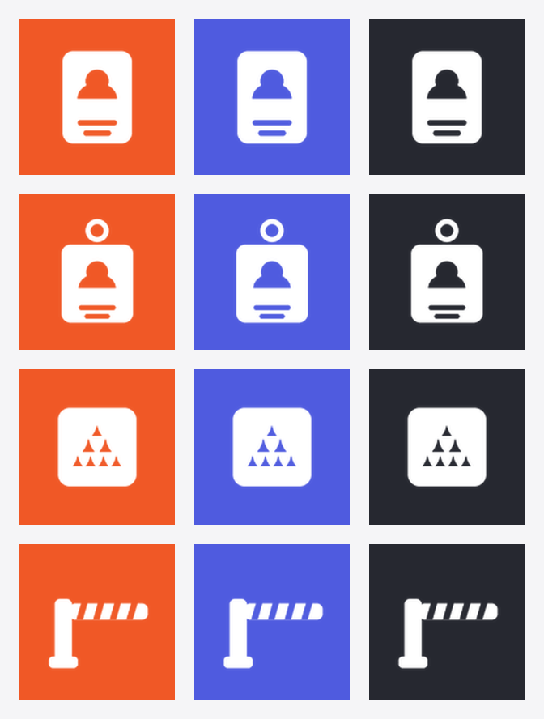

# Иконки push-уведомления - варианты

Ветка-витрина, в `dev` не мержится. Задача: заменить нынешнюю картинку уведомления на такую,
по которой видно, что пришло из бюро пропусков.

## Две разные картинки, не одна

| Роль | Где видно | Размер | Требования |
|---|---|---|---|
| `icon` | в теле уведомления, при развёрнутой шторке | 192x192 | цветная, силуэт должен читаться с ноготь |
| `badge` | в строке состояния, рядом с часами | 96x96 | только форма: Android перекрашивает значок сам, цвет из файла не используется |

## Что стоит сейчас

| icon | badge на тёмном |
|---|---|
|  |  |

Оранжевая заливка с пирамидой парка. Замечание владельца: заливка не нравится, а по силуэту
не угадывается бюро пропусков.

## Варианты формы

Все четыре в строке состояния (белый силуэт на прозрачном, как его увидит телефон):

Слева направо: пропуск, бейдж на шнурке, карточка с пирамидой, шлагбаум.

## Форма x заливка

Строки - форма (пропуск, бейдж на шнурке, карточка с пирамидой, шлагбаум),
столбцы - заливка (оранжевый логотипа, синий акцент интерфейса `#4F5BDF`, графит).

### Отдельными файлами

| Форма | Оранжевый | Синий | Графит | Значок |
|---|---|---|---|---|
| Пропуск |  |  |  | `pass-card-badge.png` |
| Бейдж на шнурке |  |  |  | `lanyard-badge.png` |
| Карточка с пирамидой |  |  |  | `card-pyramid-badge.png` |
| Шлагбаум |  |  |  | `barrier-badge.png` |

## Соображения к выбору

**Бейдж на шнурке** - самый узнаваемый силуэт: петля сверху ни с чем не путается даже в размере
строки состояния. **Пропуск** спокойнее, но в мелком размере похож на любую карточку контакта.
**Карточка с пирамидой** сохраняет связь с логотипом парка, однако пирамида внутри карточки
теряет детали первой. **Шлагбаум** - про проезд, а система не только про машины.

По заливке: синий совпадает с акцентом интерфейса, оранжевый - с логотипом парка на входе,
графит нейтрален и не спорит ни с чем на экране телефона.

Выбранный вариант переносится в `frontend/public/notification-icon.png` и
`notification-badge.png`, подключение в `frontend/public/sw.js` уже есть - меняются только файлы.
