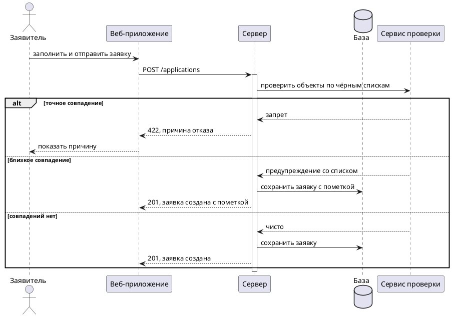
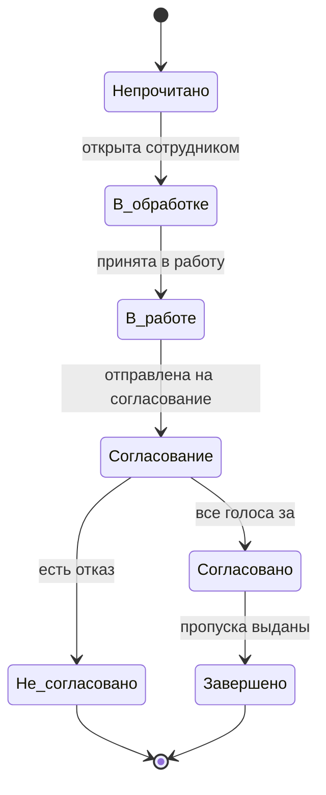

## Зачем нотации и как выбирать

Диаграмма нужна там, где текст перестаёт читаться. Процесс с восемью ветвлениями словами описывается на страницу, и эту страницу никто не удержит в голове целиком. Та же логика картинкой читается за минуту.

Обратное тоже верно: диаграмма, дублирующая абзац текста, вредна. Она требует поддержки, устаревает молча и создаёт ложное ощущение проработанности.

### Правило выбора нотации

Каждая нотация описывает свой слой. Смешение слоёв в одной диаграмме это самая частая ошибка новичка.

| Что описываем | Нотация | Ключевой вопрос слоя |
|---|---|---|
| Процесс между людьми и подразделениями | BPMN | Кто что делает и в каком порядке |
| Границы системы и роли | UML Use Case | Что система делает для кого |
| Обмен сообщениями между компонентами | UML Sequence | Кто кого вызывает и что отвечает |
| Алгоритм внутри одного действия | UML Activity | Как принимается решение |
| Жизненный цикл сущности | UML State Machine | В каких состояниях бывает объект и как переходит |
| Структура данных | ERD | Какие сущности, какие связи |
| Структура кода | UML Class | Какие классы и как связаны |
| Архитектура системы | C4 | Из чего собрана система на каждом уровне |
| Корпоративный ландшафт | ArchiMate | Как связаны бизнес, приложения и инфраструктура |

Проверка на смешение слоёв: если на диаграмме процесса появились названия таблиц базы данных, слои смешаны. Если на диаграмме последовательности появились роли пользователей вместо систем, тоже.

## BPMN

Нотация моделирования бизнес-процессов, версия 2.0. Самая востребованная у аналитиков после UML, потому что она понятна заказчику без обучения.

### Базовые элементы

**Задача (task).** Прямоугольник со скруглёнными углами, одно действие одного исполнителя. Название формулируется как глагол плюс объект: «Проверить документы», «Отметить въезд». Типы задач помечаются иконкой: пользовательская, сервисная, отправка сообщения, получение сообщения, ручная, скриптовая.

**Событие (event).** Круг. Начальное событие с тонкой границей, промежуточное с двойной, конечное с толстой. Событие бывает пустым (просто старт и финиш) или типизированным: сообщение, таймер, ошибка, сигнал, условие, эскалация.

**Шлюз (gateway).** Ромб, точка ветвления или слияния.

| Шлюз | Обозначение | Смысл |
|---|---|---|
| Эксклюзивный (XOR) | крестик | Выбирается ровно одна ветка по условию |
| Параллельный (AND) | плюс | Запускаются все ветки одновременно |
| Инклюзивный (OR) | круг | Запускаются все ветки, чьи условия истинны |
| Событийный | пятиугольник в круге | Выбор по тому, какое событие произойдёт первым |

**Пул и дорожка (pool, lane).** Пул это участник процесса как отдельная организация или система. Дорожка это роль внутри пула. Между пулами обмен идёт только сообщениями, внутри пула потоком управления. Это правило нарушают чаще всего: рисуют сплошную стрелку из пула в пул, что означает передачу управления между независимыми участниками и в BPMN некорректно.

**Поток.** Сплошная стрелка это поток управления, пунктирная это поток сообщений, точечная это ассоциация с артефактом.

**Подпроцесс.** Свёрнутый блок с плюсом, раскрывается в отдельную диаграмму. Способ бороться с полотном на сорок элементов.

### Обработка исключений

Отличие сильной модели от слабой видно в том, как описаны отказы. Инструменты BPMN для этого:

- **Граничное событие** на задаче: таймер (задача выполняется дольше срока), ошибка (сервис вернул отказ), эскалация (нужно вмешательство руководителя). Граничное событие бывает прерывающим (сплошная граница, задача останавливается) и непрерывающим (пунктирная, задача продолжается, параллельно запускается ветка).
- **Компенсация** для отката уже выполненных шагов.
- **Событийный подпроцесс** для реакции на событие, которое может случиться в любой момент процесса.

Практический пример: задача «Ожидание решения согласующего» с непрерывающим граничным таймером на трое суток, который запускает ветку «Отправить напоминание» и возвращается к ожиданию. Именно так описывается механика напоминаний, и без граничного события её пришлось бы рисовать циклом на пять элементов.

### Типичные ошибки

- Стрелка из шлюза без условия на ней.
- Эксклюзивный шлюз, у которого условия веток пересекаются или не покрывают все случаи.
- Отсутствие конечного события: процесс уходит в никуда.
- Задача, названная существительным («Проверка документов» вместо «Проверить документы»).
- Схлопывание нескольких действий в одну задачу: «Проверить, согласовать и выдать пропуск».
- Пул, в котором нет ни одной задачи, но есть стрелки насквозь.
- Отсутствие ветки отказа у любой проверки.

## UML

Унифицированный язык моделирования. Из четырнадцати типов диаграмм аналитику в работе нужны пять, остальные полезно узнавать при чтении чужих документов.

### Use Case Diagram

Показывает границы системы, акторов и набор сценариев. Это карта, а не описание поведения: детали живут в текстовых use case.

Элементы: актор (человечек, роль или внешняя система), вариант использования (овал), граница системы (прямоугольник), связи. Отношения между вариантами: include (обязательное включение, вынесенный общий кусок), extend (необязательное расширение при условии), обобщение.

Частая ошибка: превращать диаграмму в декомпозицию функций до уровня «нажать кнопку». Вариант использования это законченная ценность для актора, а не элементарное действие. «Оформить пропуск» это вариант использования, «Ввести фамилию» нет.

### Sequence Diagram

Обмен сообщениями во времени между участниками. Главный инструмент системного аналитика при проектировании интеграций.

Элементы: участники сверху, линии жизни вниз, стрелки сообщений, полоса активации, ответное сообщение пунктиром. Синхронный вызов рисуется закрашенной стрелкой, асинхронный тонкой.

**Фреймы** описывают логику:

| Фрейм | Смысл |
|---|---|
| alt | Ветвление, несколько взаимоисключающих вариантов |
| opt | Необязательный блок, выполняется при условии |
| loop | Повторение |
| par | Параллельное выполнение |
| break | Прерывание сценария |
| ref | Ссылка на другую диаграмму |
| critical | Атомарный участок |

Пример в PlantUML, из которого сразу видно, как выглядит рабочая диаграмма интеграции:

Диаграмма выше отвечает на вопросы, которые в текстовой постановке обычно теряются: какой код возврата в каждой ветке, сохраняется ли заявка при предупреждении, что видит пользователь.

### Activity Diagram

Алгоритм с ветвлениями, циклами и параллельными участками. Похожа на BPMN и часто их путают. Разница в назначении: BPMN описывает процесс между людьми и системами и понятна заказчику, activity описывает логику внутри системы и адресована разработке.

Элементы: начало, действие, решение (ромб), слияние, разделение и синхронизация параллельных потоков (толстая черта), конец. Дорожки допустимы и здесь.

### State Machine Diagram

Жизненный цикл объекта. Незаменима там, где у сущности много состояний и не все переходы разрешены.

Элементы: состояние, переход со стрелкой, событие и условие на переходе, начальное и конечное псевдосостояния, вложенные состояния, история.

Именно эта диаграмма ловит вопросы, которые иначе всплывают на тестировании: можно ли из состояния «Завершено» вернуться в «В работе», что происходит с заявкой при отзыве голоса согласующего, разрешён ли переход из «Отказано» куда-либо вообще.

Правило: рядом с диаграммой состояний обязана быть таблица переходов, где для каждого перехода указано событие, условие, кто имеет право его инициировать и какие побочные действия происходят. Диаграмма показывает форму, таблица содержит правила.

| Из | Событие | В | Кто | Побочные действия |
|---|---|---|---|---|
| Непрочитано | Открытие сотрудником бюро | В обработке | Бюро | Запись в историю, отметка прочтения |
| В обработке | Принятие в работу | В работе | Принимающий | Назначение ответственного, уведомление заявителю |
| В работе | Отправка на согласование | Согласование | Ответственный | Уведомления согласующим |
| Согласование | Все голоса положительные | Согласовано | Система | Публикация объектов в таблицы постов |
| Согласование | Хотя бы один отказ | Не согласовано | Система | Уведомление заявителю с причиной |
| Любое активное | Отзыв заявителем | Отозвана | Заявитель | Снятие незакрытых дополнений |

### Class Diagram и её отличие от ERD

Классический вопрос на собеседовании: чем class diagram отличается от ER-диаграммы.

| Признак | Class Diagram | ERD |
|---|---|---|
| Что описывает | Структуру кода: классы, их поведение | Структуру хранения: таблицы, поля |
| Содержит методы | Да | Нет |
| Наследование | Да | Нет напрямую, реализуется приёмами |
| Связь многие-ко-многим | Рисуется напрямую | Требует ассоциативной таблицы |
| Аудитория | Разработчики | Разработчики, администраторы баз данных |
| Уровень | Логика приложения | Физическое хранение |

Отношения в class diagram, которые стоит различать: ассоциация (просто связь), агрегация (часть-целое, части живут отдельно), композиция (часть-целое, части умирают вместе с целым), наследование, реализация интерфейса, зависимость.

## ERD

Диаграмма сущность-связь описывает модель данных. Подробности проектирования разобраны в конспекте по базам данных; здесь только нотация.

### Нотация Crow's Foot

Кардинальность и обязательность обозначаются символами на концах линии:

| Обозначение | Смысл |
|---|---|
| Одна вертикальная черта | Ровно один |
| Кружок | Ноль |
| Лапка (три линии) | Много |
| Кружок и лапка | Ноль или много |
| Черта и лапка | Один или много |
| Две черты | Ровно один и обязательно |

Читается связь всегда в обе стороны, и обе стороны нужно проговорить вслух: «одна заявка содержит одно или много вложений, одно вложение принадлежит ровно одной заявке». Такое проговаривание ловит ошибки моделирования лучше любой проверки.

### Три уровня модели

**Концептуальная.** Только сущности и связи, без атрибутов и типов. Язык заказчика. Помещается на одну страницу и служит предметом обсуждения с бизнесом.

**Логическая.** Атрибуты, ключи, типы в общем виде, нормализация. Не привязана к конкретной СУБД.

**Физическая.** Имена таблиц и колонок, точные типы, индексы, ограничения, партиции. Привязана к СУБД.

Аналитик обязан уметь строить первые два уровня и читать третий.

## C4

Модель описания архитектуры четырьмя уровнями увеличения. Удобна тем, что даёт разговаривать об архитектуре с разной аудиторией, не рисуя одну диаграмму на всех.

| Уровень | Что показывает | Аудитория |
|---|---|---|
| Context | Система как чёрный ящик, пользователи и внешние системы | Все, включая бизнес |
| Container | Приложения, базы, очереди, из которых состоит система, и протоколы между ними | Технические специалисты |
| Component | Внутреннее устройство одного контейнера | Разработчики |
| Code | Классы, обычно генерируется и не рисуется руками | Редко нужен |

Аналитику в работе нужны первые два уровня. Диаграмма контейнеров это лучший способ показать, куда встраивается новая интеграция.

## Прочие нотации

**DFD (диаграмма потоков данных).** Процессы, потоки, хранилища, внешние сущности. Встречается в старых документах и в учебных курсах.

**IDEF0.** Функциональное моделирование: вход, выход, управление, механизм. Обязательна в некоторых государственных документах.

**IDEF1X.** Моделирование данных, аналог ERD, встречается в госсекторе.

**EPC (событийная цепочка процессов).** Наследие SAP и ARIS, чередование событий и функций.

**ArchiMate.** Корпоративная архитектура, три слоя: бизнес, приложения, технологии. Нужна в крупных организациях с выделенной архитектурной практикой.

Все перечисленные достаточно узнавать при чтении. Рисовать в них придётся только в специфических организациях.

## Текстовые нотации

К 2026 году сдвиг в сторону диаграмм-как-кода стал заметным. Причина практическая: текстовая диаграмма лежит в системе контроля версий рядом с описанием, попадает в пул-реквест, ревьюится построчно и не расходится с реальностью молча. Картинка, нарисованная мышью, живёт своей жизнью и устаревает незаметно для всех.

| Инструмент | Сильная сторона | Где применяют |
|---|---|---|
| PlantUML | Полное покрытие UML, зрелость | Sequence, class, state, use case |
| Mermaid | Рендерится прямо в разметке репозиториев и вики | Быстрые схемы в документации |
| D2 | Современная типографика, авторазмещение | Архитектурные схемы |
| Structurizr | Модель C4 как код, одна модель на все уровни | Архитектурные описания |
| Graphviz | Точный контроль графов | Сложные зависимости |
| Camunda Modeler | Полноценный редактор BPMN с валидацией | Процессы, исполняемые схемы |

Пример состояний в Mermaid, который отрендерится в большинстве вики и репозиториев:

Совет для тех, кто приходит из разработки: текстовые нотации это ваше преимущество. Освоение занимает вечер, а диаграммы перестают быть отдельным артефактом, который кто-то должен помнить обновить.

## Чек-лист качества диаграммы

Прогонять перед тем, как показывать другим:

- У диаграммы есть название и указано, что именно она описывает.
- Слои не смешаны: одна диаграмма отвечает на один вопрос.
- Все ветвления имеют условия, и условия покрывают все случаи.
- Описан хотя бы один путь отказа.
- Нет висящих элементов без входящих или исходящих связей.
- Названия действий начинаются с глагола, названия сущностей с существительного.
- Термины совпадают с глоссарием, а не изобретены заново.
- Помещается на один экран или разбита на подпроцессы.
- Понятна человеку, который не присутствовал при её создании. Проверяется просто: дать посмотреть коллеге и попросить пересказать.
- Хранится там же, где текстовая постановка, и обновляется вместе с ней.
